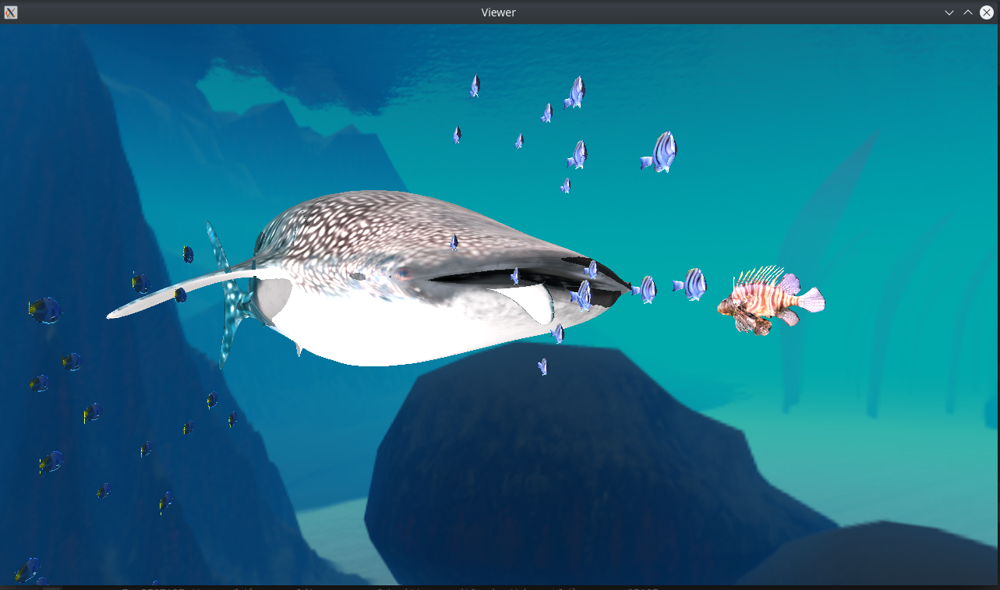
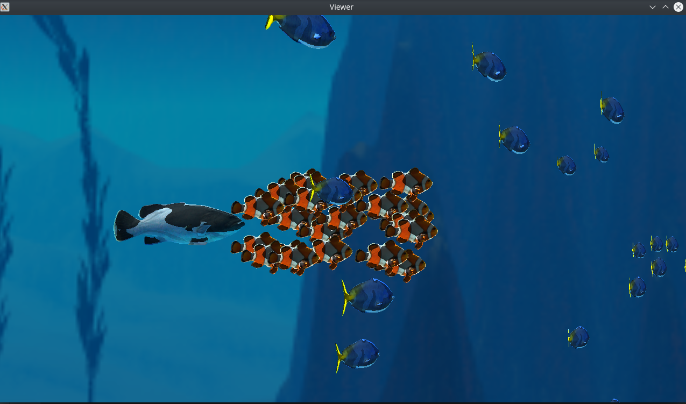
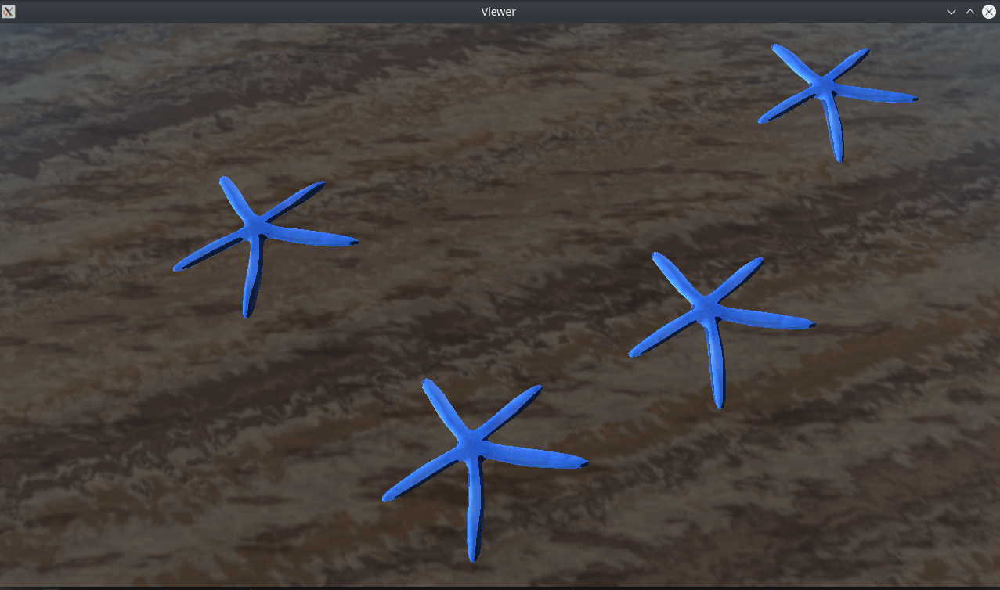
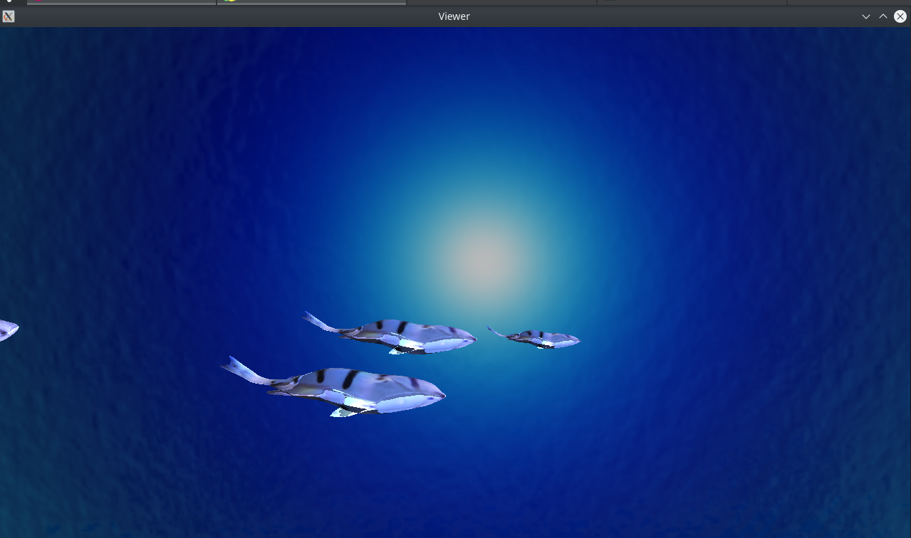
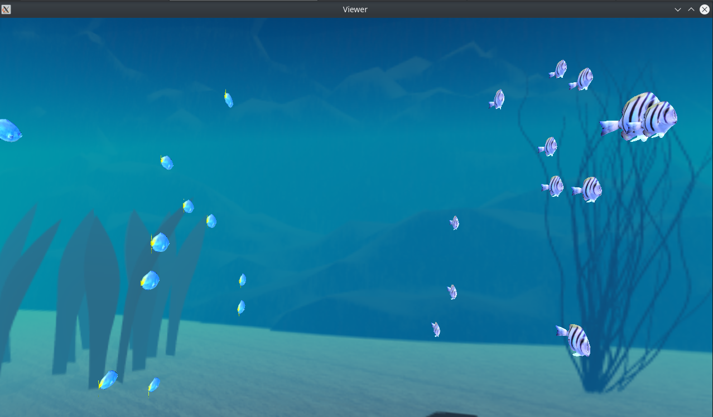
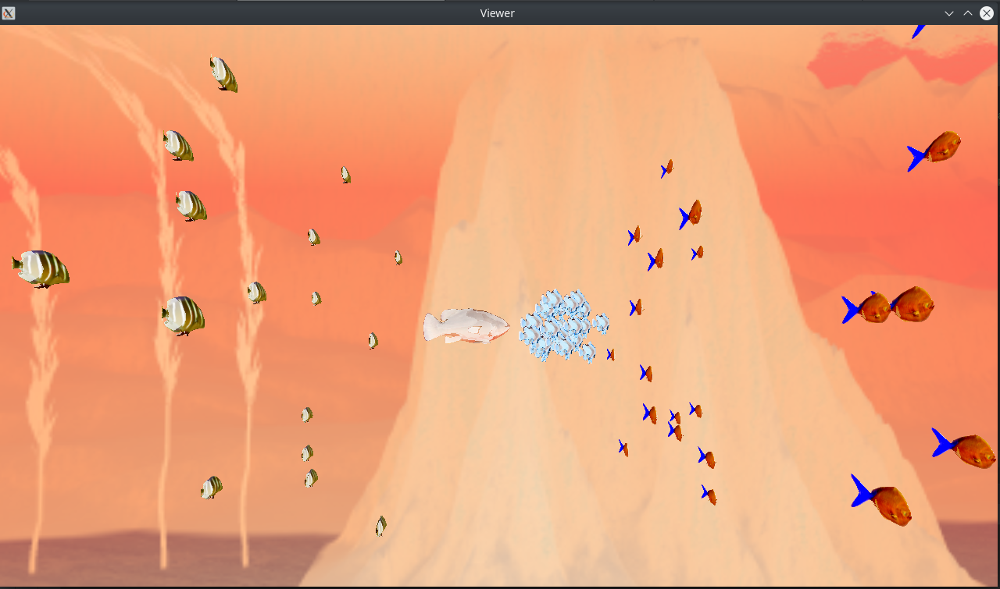
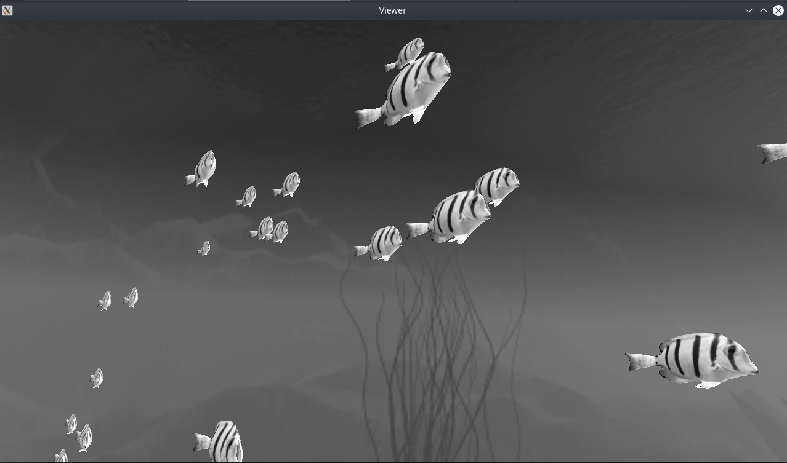
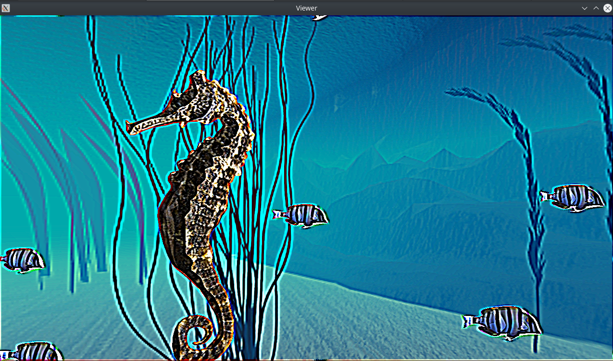
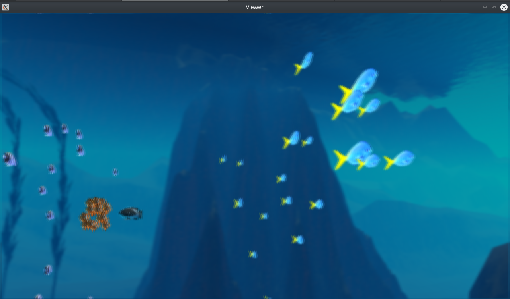
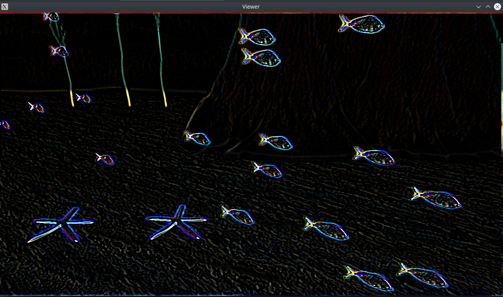

= 3D Programming Project
:authors: Chakka Karthik Subramanyam; Firsov Oleksandr; Hunt Christopher
:revdate: 11-05-2020
:doctype: article

== Group
* Chakka Karthik Subramanyam
* Firsov Oleksandr
* Hunt Christopher

== Prequisites
No extra packages/libraries required other than the ones we used for lab

== Controls
* Hover Mouse: Look Around
* Scroll Wheel: Zoom In/Out
* F6/F7: Exposure Control
* E: Special Effects
* SPACE: Restart Keyframe Animation
* Escape/Q: Exit

== Feature List
* Dynamic Camera
* Modelling
** Hierarchical Modeling
** Simple Boids
* Rendering
** Skybox
** Multiple lights
*** 1 directional light
*** 4 point lights
** Frame buffer effects
*** Subtle wavy motion
*** Exposure control
*** Edge detection
*** Gaussian blur
*** Sharpening filter
*** Sharpening filter
*** Inverted color
*** Grayscale
* Animation
** Procedural Animation
*** Eternal chase
*** Seahorse/Lionfish "floating" motion
*** Circular boids
** Keyframe Animation
*** Whaleshark
*** Lionfish disappearing

== Who did what

Code architecture and Rendering:

* Karthik

Modelling and Animation:

* Chris and Oleksandr

== Source code
https://gitlab.ensimag.fr/chakkak/3d

== Difficulties and Future scope
Due to current pandemic situation, we had lot of challenges to manage submissions of all the subjects on time.
Though we were passionate and wanted to do more in this project, we had to make some design sacrifices to balance time between multiple submission.
For ex:

* There could have been inter-boid animation
* More interesting/complex shapes in procedural animation
* Bubbles
* Interaction between fishes and environment
* Caustics etc...

== Screenshots

=== Pictures

=== Video

Please go to: *./scrshots./Atlantis.mp4*. We have prepared an underwater symphony.

